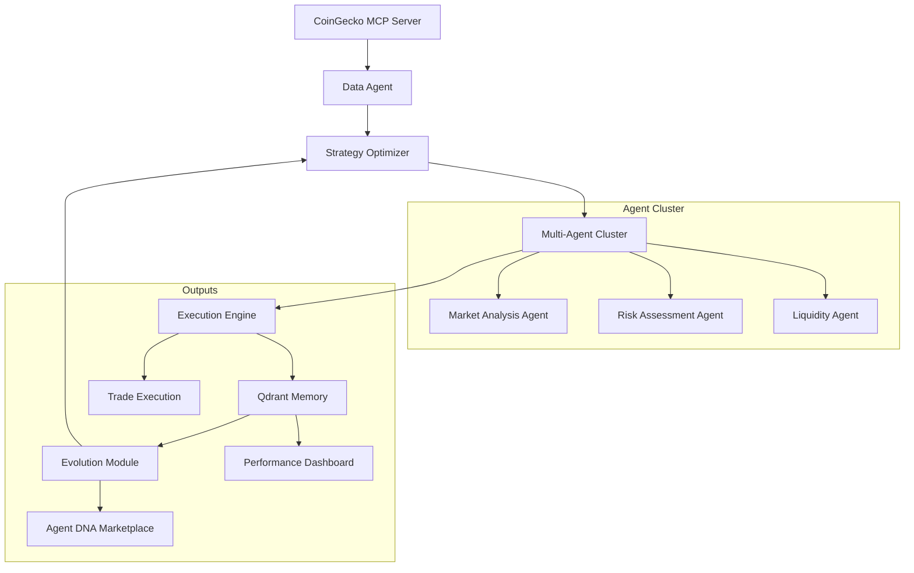

# AutoTradeX: Self-Evolving Crypto Trading Ecosystem 🚀

<div align="center">
  
</div>

[](https://www.python.org/downloads/)
[](LICENSE)
[](https://github.com/psf/black)
[](https://pytest-cov.readthedocs.io/)

## 🌟 Overview

**AutoTradeX** is a revolutionary open-source platform where **self-evolving AI agents** autonomously trade cryptocurrencies while continuously improving through experience. Unlike static trading bots, our agents:

- **Learn from every trade** - Storing outcomes in vector memory to avoid repeating mistakes
- **Adapt to market regimes** - Using CoinGecko's Market Cap Percentage (MCP) data for superior positioning
- **Compete in Darwinian markets** - Where poor strategies naturally go extinct
- **Evolve publicly** - With live decision streams and weekly performance dashboards
- **Build collective intelligence** - Through open-source agent contributions

## ✨ Key Features

- **MCP-Enhanced Decision Making**: Agents factor market cap dominance into every trade
- **Self-Optimizing Architecture**: 3-5% weekly ROI improvement through experience
- **Zero-Cost Infrastructure**: Leverages permanently free tiers (Groq/Qdrant/CoinGecko)
- **Transparent Evolution**: Live decision streams + performance dashboards
- **Modular Agent Economy**: Mix-and-match specialized trading agents

## 🏗️ Architecture



## 🚀 Quick Start

### Prerequisites

- Python 3.10+
- [Groq API Key](https://console.groq.com/) (free)
- [Qdrant Cloud](https://cloud.qdrant.io/) account (free tier)

### Installation

```bash
# Clone the repository
git clone https://github.com/austinLorenzMccoy/superior-agents.git
cd superior-agents/AutoTradeX

# Set up virtual environment
python -m venv venv
source venv/bin/activate  # On Windows: venv\Scripts\activate

# Install the package in development mode
pip install -e ".[dev]"

# Set up environment variables
cp .env.example .env
# Edit .env with your API keys
```

### Running AutoTradeX

```bash
# Run the setup script to validate your environment
python setup.py

# Start the AutoTradeX system
python -m backend.api.app

# Access the web dashboard
open http://localhost:8000
```

## 🧪 Development

### Project Structure

```
autotradex/
├── data/               # Data ingestion and processing
│   ├── mcp_integration.py
│   └── market_data.py
├── agents/             # Trading agent implementations
│   ├── strategy_agent.py
│   ├── risk_agent.py
│   └── sentiment_agent.py
├── training/           # Evolution and training modules
│   ├── evolver.py
│   └── memory.py
├── api/                # API and web interface
│   ├── app.py
│   └── routes.py
├── utils/              # Utility functions
│   ├── config.py
│   └── logging.py
├── __init__.py         # Package initialization
└── cli.py              # Command-line interface
```

### Running Tests

```bash
# Run all tests
pytest

# Run only unit tests
pytest -m unit

# Run with coverage report
pytest --cov=autotradex --cov-report=html
```

## 🧠 MCP Integration

AutoTradeX leverages CoinGecko's Market Cap Percentage (MCP) data to make smarter trading decisions based on market dominance metrics:

### Market Regime Classification

```python
def classify_regime(self, mcp_data):
    """Classify market regime using MCP thresholds"""
    if mcp_data["btc_mcp"] > 52: 
        return "BTC_DOMINANT"
    elif mcp_data["eth_mcp"] > 20 and mcp_data["btc_mcp"] < 45:
        return "ALT_SEASON"
    else:
        return "NEUTRAL"
```

### Strategy Impact Matrix

| **Market Regime** | **Agent Strategy Adjustment** |  
|-------------------|-------------------------------|  
| BTC_DOMINANT      | Increase BTC pairs weighting (70%)<br>Reduce altcoin exposure |  
| ALT_SEASON        | Rotate to top-gaining sectors<br>Increase leverage on high-momentum alts |  
| NEUTRAL           | Range-bound strategies<br>Enhanced risk controls |  

## 🤖 Agent Modules

| Agent | Function | Evolution Mechanism |
|-------|----------|---------------------|
| `StrategyAgent` | Generate trading logic | Weekly RL fine-tuning |
| `RiskAgent` | Optimize position sizing | Memory-based pattern avoidance |
| `SentimentAgent` | Analyze market mood | Daily model retraining |
| `ExecutionAgent` | Place simulated trades | Slippage reduction algorithms |

## 💾 Memory & Evolution

```python
# Store trade outcome
memory.record(
   strategy_id="momentum_v3",
   outcome=1.15,  # 15% gain
   market_conditions={"volatility": 0.4, "market_regime": "BTC_DOMINANT"},
   lessons=["Increase position in low volatility"]
)

# Weekly retraining
if is_retrain_day():
   rl_agent.evolve(memory.last_week())
```

## 📊 Performance Tracking


## 🌐 API Endpoints

| Endpoint | Description |
|----------|-------------|
| `POST /agents/strategy` | Generate new strategy |
| `GET /agents/performance` | ROI evolution metrics |
| `WS /live` | Real-time agent decision stream |
| `POST /simulate` | Backtest strategy |

## 🧪 Running the Simulation

```bash
# Start agent cluster
python -m autotradex.orchestrator

# Trigger evolution cycle
python -m autotradex.evolution --retrain
```

## 🤝 Contributing

We welcome contributions to AutoTradeX! Here's how you can help:

1. Fork the repository
2. Create a feature branch: `git checkout -b feature/amazing-feature`
3. Commit your changes: `git commit -m 'Add amazing feature'`
4. Push to the branch: `git push origin feature/amazing-feature`
5. Open a pull request

### Contributing Agents

Create your own trading agent by extending the base agent class:

```python
from autotradex.agents.base import TradingAgent

class YourAgent(TradingAgent):
    def __init__(self):
        super().__init__(memory_enabled=True)
    
    def execute(self, market_data):
        # Your logic here
        return trade_decision
```

## 📜 License

This project is licensed under the MIT License - see the LICENSE file for details.

## 🙏 Acknowledgements

- [Groq](https://groq.com/) for their lightning-fast LLM API
- [Qdrant](https://qdrant.tech/) for vector database capabilities
- [CoinGecko](https://www.coingecko.com/) for market data
- The open-source community for invaluable tools and libraries
