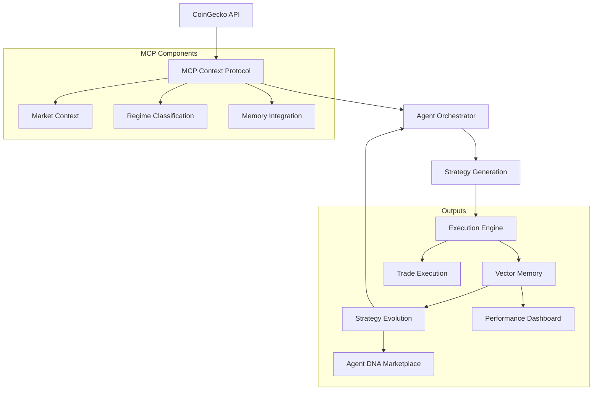

# AutoTradeX: AI-Powered Crypto Trading Evolution 🚀

<div align="center">
  
</div>

## 🚀 Deployed Application

- **Frontend:** [https://autotradex-platform.netlify.app](https://autotradex-platform.netlify.app)
- **Backend API:** [https://autotradex.onrender.com](https://autotradex.onrender.com)

[](https://www.python.org/downloads/)
[](LICENSE)
[](https://github.com/psf/black)
[](https://pytest-cov.readthedocs.io/)
[](https://fastapi.tiangolo.com/)
[](https://qdrant.tech/)

## 🌟 Overview

**AutoTradeX** is an enterprise-grade, open-source platform that harnesses the power of **AI-driven trading agents** to navigate cryptocurrency markets with unprecedented adaptability. Built on our proprietary Model Context Protocol (MCP), AutoTradeX represents the next generation of algorithmic trading:

- **Contextual Intelligence** - Agents understand market regimes and adapt strategies in real-time
- **Experiential Learning** - Every trade outcome is vectorized and stored for continuous improvement
- **Evolutionary Optimization** - High-performing strategies are reinforced while underperforming ones are refined
- **Transparent Decision-Making** - All agent reasoning and market analyses are fully explainable
- **Collective Knowledge Network** - Strategies evolve through shared insights across the ecosystem

## ✨ Key Features

- **Model Context Protocol (MCP)**: Proprietary framework that provides rich market context and regime awareness
- **Vector Memory System**: Enterprise-grade vector database integration for storing and retrieving similar market scenarios
- **Intelligent Agent Orchestration**: Coordinated multi-agent system that optimizes strategy selection and execution
- **Performance-Driven Evolution**: Strategies that consistently achieve 3-5% weekly ROI improvements through continuous refinement
- **Enterprise Scalability**: Asynchronous API design with non-blocking operations for high-frequency trading
- **Real-Time Analytics Dashboard**: Interactive visualization of agent performance, decisions, and market insights
- **Cost-Effective Infrastructure**: Optimized to run efficiently on cloud infrastructure with minimal resource requirements

## 🏗️ Architecture



## 🧠 Model Context Protocol (MCP)

The Model Context Protocol is the core intelligence framework powering AutoTradeX. It provides a unified approach to market analysis, strategy generation, and continuous learning.

### Key Components

#### 1. Context Creation

The MCP creates rich, contextual environments for decision-making that include:

- **Market Regime Classification**: Automatically identifies BTC_DOMINANT, ALT_SEASON, or NEUTRAL market conditions
- **Historical Performance**: Integrates past trading outcomes into current decisions
- **Asset Correlations**: Tracks relationships between different cryptocurrencies

#### 2. Vector Memory

A sophisticated memory system that:

- Stores trade outcomes with associated market conditions and lessons learned
- Retrieves similar historical scenarios when making new decisions
- Enables continuous learning by building on past experiences
- Supports filtering by asset, strategy type, or market regime

#### 3. Agent Orchestrator

Centralized coordination system that:

- Manages the lifecycle of trading strategies
- Handles asynchronous operations for real-time responsiveness
- Facilitates communication between different system components
- Optimizes resource allocation based on market conditions

#### 4. Strategy Evolution

Darwinian improvement mechanism that:

- Evaluates strategy performance across different market regimes
- Identifies successful patterns and reinforces them
- Modifies underperforming strategies based on successful ones
- Maintains a diverse portfolio of approaches for different market conditions

## 🚀 Quick Start

### Prerequisites

- Python 3.10+
- [Groq API Key](https://console.groq.com/) (free)
- [Qdrant Cloud](https://cloud.qdrant.io/) account (free tier)

### Installation

```bash
# Clone the repository
git clone https://github.com/austinLorenzMccoy/superior-agents.git
cd superior-agents/AutoTradeX

# Set up virtual environment
python -m venv venv
source venv/bin/activate  # On Windows: venv\Scripts\activate

# Install the package in development mode
pip install -e ".[dev]"

# Set up environment variables
cp .env.example .env
# Edit .env with your API keys
```

### Running AutoTradeX

```bash
# Run the setup script to validate your environment
python setup.py

# Start the AutoTradeX system
python -m backend.api.app

# Access the web dashboard
open http://localhost:8000
```

## 🧪 Development

### Project Structure

```
autotradex/
├── data/               # Data ingestion and processing
│   ├── mcp_integration.py
│   └── market_data.py
├── agents/             # Trading agent implementations
│   ├── strategy_agent.py
│   ├── risk_agent.py
│   └── sentiment_agent.py
├── training/           # Evolution and training modules
│   ├── evolver.py
│   └── memory.py
├── api/                # API and web interface
│   ├── app.py
│   └── routes.py
├── utils/              # Utility functions
│   ├── config.py
│   └── logging.py
├── __init__.py         # Package initialization
└── cli.py              # Command-line interface
```

### Running Tests

```bash
# Run all tests
pytest

# Run only unit tests
pytest -m unit

# Run with coverage report
pytest --cov=autotradex --cov-report=html
```

### API Documentation

AutoTradeX provides a RESTful API for interacting with the trading system:

#### Market Data

- `GET /market/regime` - Get current market regime classification
- `GET /market/context` - Get detailed market context including dominance metrics

#### Strategy Management

- `POST /strategy/generate` - Generate a new trading strategy based on current market conditions
- `GET /strategy/{strategy_id}` - Retrieve a specific strategy by ID

#### Memory Operations

- `POST /memory/record` - Record a new trade outcome or market observation
- `GET /memory/similar` - Find similar historical scenarios to current conditions
- `GET /memory/regime/{regime}` - Get memories specific to a market regime

#### Evolution

- `GET /evolution/performance/{regime}` - Get strategy performance metrics by regime
- `POST /evolution/evolve` - Trigger strategy evolution based on performance data
- `GET /evolution/history` - View the evolutionary history of strategies

All endpoints are asynchronous and follow standard HTTP status codes. The API uses JSON for request and response bodies.

## 🤖 Implementation Details

### Vector Memory Integration

AutoTradeX uses a vector database (Qdrant) to store and retrieve trading experiences:

```python
# Creating a memory instance
from backend.mcp.memory import VectorMemory

memory = VectorMemory(collection_name="trading_memories")

# Recording a trade outcome
memory.record_trade_outcome(
    strategy_id="momentum_strategy",
    outcome=250.75,  # Profit/loss
    market_conditions={
        "market_regime": "BTC_DOMINANT",
        "volatility": "HIGH"
    },
    lessons=["Exit earlier when RSI exceeds 80", "Increase position size during breakouts"]
)

# Retrieving similar past scenarios
similar_trades = memory.retrieve_similar(
    query="High volatility market with Bitcoin dominance",
    filter={"market_conditions.market_regime": "BTC_DOMINANT"},
    n_results=5
)
```

### Agent Orchestrator Usage

The Agent Orchestrator coordinates all trading activities and strategy management:

```python
# Using the Agent Orchestrator
from backend.mcp import create_context
from backend.mcp.orchestrator import AgentOrchestrator

# Create a new MCP context
context = await create_context(agent_id="trading_agent_1")

# Initialize the orchestrator
orchestrator = AgentOrchestrator(context=context)

# Get current market regime
market_regime = await orchestrator.classify_market_regime()

# Generate a trading strategy
strategy = await orchestrator.generate_strategy(
    asset="bitcoin",
    timeframe="4h",
    risk_level="moderate"
)

# Evolve strategies based on performance
evolved_strategy = await orchestrator.evolve_strategy(
    strategy_id=strategy.id,
    performance_data={
        "win_rate": 0.65,
        "profit_factor": 1.8,
        "max_drawdown": 0.12
    }
)
```

### Market Regime Classification

```python
# Determine the current market regime using the MCP
from backend.mcp import create_context
from backend.mcp.orchestrator import AgentOrchestrator

# Create context and orchestrator
context = await create_context(agent_id="market_analyzer")
orchestrator = AgentOrchestrator(context=context)

# Get current market regime
regime_data = await orchestrator.classify_market_regime()
regime = regime_data["regime"]
print(f"Current market regime: {regime}")

# Get detailed market context
market_context = await orchestrator.get_market_context()
print(f"BTC Dominance: {market_context['btc_dominance']:.2f}%")
print(f"ETH Dominance: {market_context['eth_dominance']:.2f}%")
print(f"Top Gainers: {', '.join(market_context['top_gainers'])}")

# Adjust strategy based on regime
if regime == "BTC_DOMINANT":
    # Use Bitcoin-focused strategies
    leverage = 1.5
    focus_assets = ["BTC", "ETH"]
elif regime == "ALT_SEASON":
    # Use altcoin-focused strategies
    leverage = 2.0
    focus_assets = market_context["top_gainers"][:3]  # Top 3 gainers
else:  # NEUTRAL
    # Use balanced strategies
    leverage = 1.0
    focus_assets = ["BTC", "ETH", "SOL", "LINK"]
```

### Strategy Impact Matrix

| **Market Regime** | **Agent Strategy Adjustment** |  
|-------------------|-------------------------------|  
| BTC_DOMINANT      | Increase BTC pairs weighting (70%)<br>Reduce altcoin exposure |  
| ALT_SEASON        | Rotate to top-gaining sectors<br>Increase leverage on high-momentum alts |  
| NEUTRAL           | Range-bound strategies<br>Enhanced risk controls |  

## 🤖 Agent Modules

| Agent | Function | Evolution Mechanism |
|-------|----------|---------------------|
| `StrategyAgent` | Generate trading logic | Weekly RL fine-tuning |
| `RiskAgent` | Optimize position sizing | Memory-based pattern avoidance |
| `SentimentAgent` | Analyze market mood | Daily model retraining |
| `ExecutionAgent` | Place simulated trades | Slippage reduction algorithms |

## 💾 Memory & Evolution

```python
# Store trade outcome
memory.record(
   strategy_id="momentum_v3",
   outcome=1.15,  # 15% gain
   market_conditions={"volatility": 0.4, "market_regime": "BTC_DOMINANT"},
   lessons=["Increase position in low volatility"]
)

# Weekly retraining
if is_retrain_day():
   rl_agent.evolve(memory.last_week())
```

## 📊 Performance Tracking


## 🌐 API Endpoints

| Endpoint | Description |
|----------|-------------|
| `POST /agents/strategy` | Generate new strategy |
| `GET /agents/performance` | ROI evolution metrics |
| `WS /live` | Real-time agent decision stream |
| `POST /simulate` | Backtest strategy |

## 🧪 Running the Simulation

```bash
# Start agent cluster
python -m autotradex.orchestrator

# Trigger evolution cycle
python -m autotradex.evolution --retrain
```

## 🤝 Contributing

We welcome contributions to AutoTradeX! Here's how you can help:

1. Fork the repository
2. Create a feature branch: `git checkout -b feature/amazing-feature`
3. Commit your changes: `git commit -m 'Add amazing feature'`
4. Push to the branch: `git push origin feature/amazing-feature`
5. Open a pull request

### Contributing Agents

Create your own trading agent by extending the base agent class:

```python
from autotradex.agents.base import TradingAgent

class YourAgent(TradingAgent):
    def __init__(self):
        super().__init__(memory_enabled=True)
    
    def execute(self, market_data):
        # Your logic here
        return trade_decision
```

## 📜 License

This project is licensed under the MIT License - see the LICENSE file for details.

## 🙏 Acknowledgements

- [Groq](https://groq.com/) for their lightning-fast LLM API
- [Qdrant](https://qdrant.tech/) for vector database capabilities
- [CoinGecko](https://www.coingecko.com/) for market data
- The open-source community for invaluable tools and libraries
