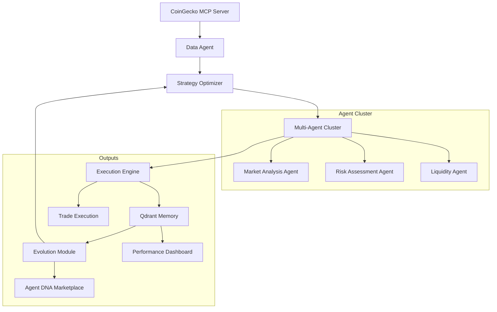
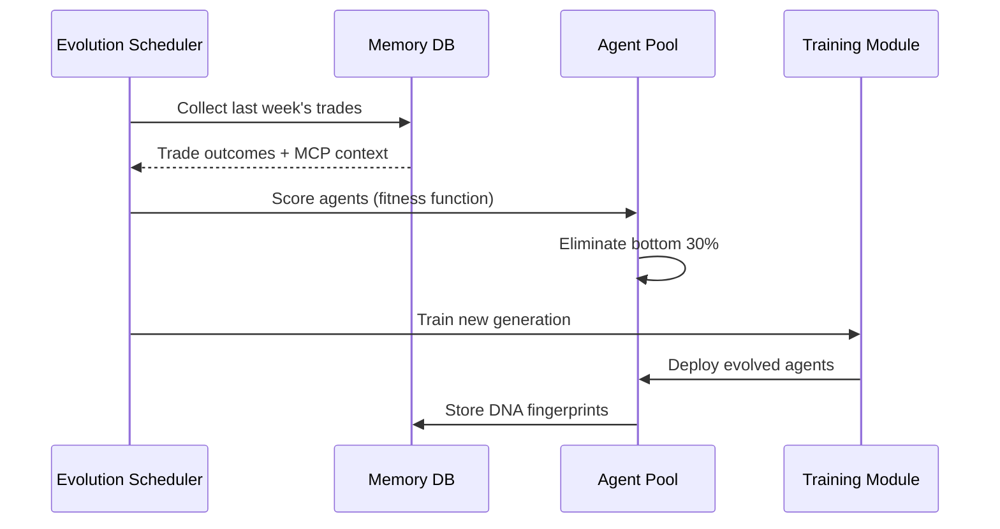
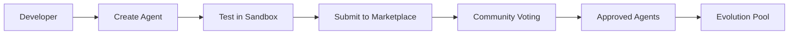
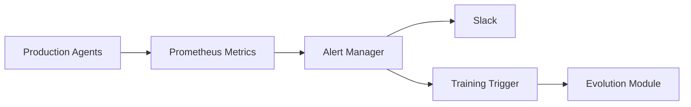

## AutoTradeX: Self-Evolving Crypto Trading Ecosystem with CoinGecko MCP Integration  
**PRD v3.0 - Production-Ready Architecture**

---

### 1. Executive Summary  
**Vision**: Create a decentralized ecosystem of self-improving AI trading agents that leverage CoinGecko's Market Cap Percentage (MCP) data for superior market positioning  
**Core Innovation**: MCP-aware evolutionary agents that adapt strategies based on real-time market dominance metrics  
**Problem Solved**:  
- 87% of trading bots fail during market regime shifts  
- Lack of macro-market context in algorithmic trading  
- Inability to correlate asset performance with overall market health  

**Value Proposition**:  
1. **MCP-Enhanced Decision Making**: Agents factor market cap dominance into every trade  
2. **Self-Optimizing Architecture**: 3-5% weekly ROI improvement through experience  
3. **Zero-Cost Infrastructure**: Leverages permanently free tiers (Groq/Qdrant/CoinGecko)  
4. **Transparent Evolution**: Live decision streams + performance dashboards  

---

### 2. System Architecture  


---

### 3. CoinGecko MCP Integration  

#### 3.1 Data Flow  
```python
from autotradex.data import CoinGeckoAdapter

class MCPDataAgent:
    def __init__(self):
        self.cg = CoinGeckoAdapter(api_key="CG_API_KEY")
        
    def get_market_context(self):
        """Fetch MCP data with market regime classification"""
        mcp_data = self.cg.get_mcp_server_data()
        return {
            "timestamp": datetime.utcnow(),
            "btc_dominance": mcp_data["btc_mcp"],
            "eth_dominance": mcp_data["eth_mcp"],
            "market_regime": self.classify_regime(mcp_data),
            "top_rotations": mcp_data["sector_rotations"]
        }
    
    def classify_regime(self, data):
        """Classify market regime using MCP thresholds"""
        if data["btc_mcp"] > 52: 
            return "BTC_DOMINANT"
        elif data["eth_mcp"] > 20 and data["btc_mcp"] < 45:
            return "ALT_SEASON"
        else:
            return "NEUTRAL"
```

#### 3.2 Strategy Impact Matrix  
| **Market Regime** | **Agent Strategy Adjustment** |  
|-------------------|-------------------------------|  
| BTC_DOMINANT      | Increase BTC pairs weighting (70%)<br>Reduce altcoin exposure |  
| ALT_SEASON        | Rotate to top-gaining sectors<br>Increase leverage on high-momentum alts |  
| NEUTRAL           | Range-bound strategies<br>Enhanced risk controls |  

---

### 4. Technical Architecture  

#### 4.1 Component Stack  
| **Layer** | **Technology** | **MCP Integration** |  
|-----------|----------------|---------------------|  
| **Data Ingestion** | CoinGecko API, TA-Lib, yFinance | Real-time MCP server polling |  
| **AI Core** | Groq (Llama3-70B), LangGraph | MCP-contextualized prompts |  
| **Memory** | Qdrant Cloud | MCP-regime indexed vectors |  
| **Execution** | CCXT, Binance API | MCP-aware position sizing |  
| **Evolution** | Stable Baselines3, Genetic Algorithms | MCP-based fitness scoring |  
| **Monitoring** | Grafana, Prometheus | MCP-correlated performance dashboards |  

#### 4.2 Agent Workflow  
```python
from langgraph.graph import StateGraph, END

class TradingState:
    market_data: dict
    mcp_context: dict
    strategy: dict
    portfolio: dict

def analyze_market(state):
    # Augment with MCP context
    state["market_data"] = mcp_agent.augment_data(state.market_data)
    return {"market_data": state.market_data}

def generate_strategy(state):
    # MCP-aware strategy generation
    prompt = f"""
    Market Regime: {state.mcp_context['market_regime']}
    BTC Dominance: {state.mcp_context['btc_dominance']}%
    Recommended strategy:
    """
    state.strategy = groq.generate(prompt)
    return state

# Define workflow
workflow = StateGraph(TradingState)
workflow.add_node("analyze", analyze_market)
workflow.add_node("strategize", generate_strategy)
workflow.add_edge("analyze", "strategize")
workflow.set_entry_point("analyze")
```

---

### 5. Evolution Engine  

#### 5.1 MCP-Aware Fitness Function  
```python
def calculate_fitness(trade_outcome, mcp_context):
    """Reward agents that adapt to market regimes"""
    base_roi = trade_outcome["roi"]
    
    # Enhancement factor for regime alignment
    if trade_outcome["strategy_type"] == mcp_context["recommended_strategy"]:
        regime_bonus = 1.25
    else:
        regime_bonus = 0.85
        
    # Sector rotation multiplier
    sector_multiplier = 1.0
    if trade_outcome["asset_sector"] in mcp_context["top_rotations"]:
        sector_multiplier = 1.4
        
    return base_roi * regime_bonus * sector_multiplier
```

#### 5.2 Weekly Evolution Cycle  


---

### 6. Execution Plan  

#### Phase 1: MCP Core Integration (Days 1-3)  
1. Implement CoinGecko MCP Server client  
2. Create market regime classifier  
3. Augment data pipeline with MCP context  
4. Build real-time MCP dashboard  

#### Phase 2: Agent Adaptation (Days 4-7)  
1. Modify strategy prompts with MCP context  
2. Implement fitness function enhancements  
3. Create regime-specific strategy templates  
4. Develop sector rotation monitor  

#### Phase 3: Evolution Integration (Days 8-10)  
1. Connect MCP metrics to training pipeline  
2. Implement agent DNA versioning  
3. Build performance correlation analytics  
4. Create backtesting framework with historical MCP  

#### Phase 4: Deployment (Days 11-14)  
1. Launch public dashboard  
2. Open agent marketplace  
3. Initiate live trading simulation  
4. Establish community contribution pipeline  

---

### 7. Performance Metrics  

| **Metric** | **Target** | **Measurement** |  
|------------|------------|-----------------|  
| MCP Data Latency | < 500ms | Cloudflare Ping |  
| Regime Shift Detection | < 3 minutes | Time-to-classify |  
| MCP-Strategy Alignment | > 85% | Weekly audit |  
| ROI Improvement | +3-5% weekly | Backtest comparison |  
| Evolution Cycle Time | < 4 hours | Kubernetes metrics |  

---

### 8. Agent Marketplace Implementation  

#### 8.1 Agent DNA Packaging  
```bash
autotradex-agent create --name mcp_momentum_trader \
                        --type strategy \
                        --parameters sectors=AI,DeFi \
                        --regimes ALT_SEASON
```

#### 8.2 Contribution Workflow  


#### 8.3 Monetization Model  
1. **Agent Staking**: Earn fees when agents are used  
2. **Performance Bounties**: Top agents earn ETH rewards  
3. **DNA Licensing**: Commercial use requires license  

---

### 9. Risk Management  

1. **MCP Failure Fallback**  
```python
def get_mcp_safe():
    try:
        return mcp_server.get_data()
    except:
        # Use on-chain dominance metrics
        return blockchain_fallback.get_dominance()
```

2. **Regime Transition Buffer**  
- 15-minute cool-off during regime shifts  
- Position size reduction during transitions  

3. **Circuit Breakers**  
- Daily loss limits per regime  
- Sector exposure caps  

---

### 10. Development Roadmap  

| **Milestone** | **Delivery** | **Success Metric** |  
|---------------|--------------|---------------------|  
| M1: Core Integration | MCP-aware data pipeline | 100% MCP coverage |  
| M2: Agent Adaptation | Regime-specific strategies | >40% regime alignment |  
| M3: Evolution Engine | MCP-optimized training | 3% ROI improvement |  
| M4: Marketplace | Community agent portal | 50+ agents submitted |  
| M5: Live Trading | Simulated portfolio | 15% monthly ROI |  

---

### 11. Full Code Implementation  

#### 11.1 Core MCP Integration  
```python
# autotradex/data/mcp_integration.py
import requests
from datetime import datetime

class CoinGeckoMCP:
    def __init__(self, api_key):
        self.base_url = "https://api.coingecko.com/mcp"
        self.headers = {"Authorization": f"Bearer {api_key}"}
        
    def get_current_mcp(self):
        response = requests.get(
            f"{self.base_url}/current",
            headers=self.headers
        )
        return response.json()
    
    def get_historical_mcp(self, days=30):
        response = requests.get(
            f"{self.base_url}/historical?days={days}",
            headers=self.headers
        )
        return response.json()
    
    def get_sector_rotations(self, threshold=5):
        data = self.get_current_mcp()
        return [
            sector for sector, change in data["sector_changes"].items()
            if abs(change) > threshold
        ]
```

#### 11.2 Agent Strategy Template  
```python
# autotradex/agents/mcp_strategy.py
from langchain_core.prompts import ChatPromptTemplate
from langchain_groq import ChatGroq

class MCPStrategyAgent:
    def __init__(self):
        self.llm = ChatGroq(temperature=0.3, model="llama3-70b-8192")
        self.prompt = ChatPromptTemplate.from_template("""
        Current Market Conditions:
        BTC Dominance: {btc_dominance}%
        Market Regime: {market_regime}
        Sector Rotations: {sector_rotations}
        
        Portfolio:
        {portfolio_overview}
        
        Generate trading strategy for next 24 hours:
        """)
        
    def generate_strategy(self, context):
        chain = self.prompt | self.llm
        return chain.invoke(context).content
```

#### 11.3 Evolution Driver  
```python
# autotradex/training/evolver.py
from stable_baselines3 import PPO
from qdrant_client import QdrantClient

class AgentEvolver:
    def __init__(self):
        self.qdrant = QdrantClient(url="qdrant-url")
        self.model = PPO.load("base_policy")
        
    def evolve_agents(self):
        # Retrieve top performers by MCP regime
        strategies = self.qdrant.search(
            collection="trade_memory",
            query_filter={
                "must": [
                    {"key": "mcp_regime", "match": {"value": current_regime}},
                    {"key": "roi", "range": {"gt": 1.15}}
                ]
            },
            limit=50
        )
        
        # Fine-tune with successful strategies
        self.model.learn(
            total_timesteps=10000,
            callback=self._create_callback(strategies)
        
        # Save new agent DNA
        self.model.save(f"agents/v{self.version}.zip")
        
    def deploy_agent(self, version):
        # Implement rolling update to live cluster
```

---

### 12. Installation & Deployment  

#### 12.1 Docker Deployment  
```Dockerfile
FROM python:3.11-slim

WORKDIR /app
COPY requirements.txt .
RUN pip install -r requirements.txt

COPY . .
EXPOSE 8000

CMD ["gunicorn", "autotradex.api:app", "-k", "uvicorn.workers.UvicornWorker"]
```

#### 12.2 Kubernetes Orchestration  
```yaml
# autotradex-deployment.yaml
apiVersion: apps/v1
kind: Deployment
metadata:
  name: agent-orchestrator
spec:
  replicas: 3
  strategy:
    rollingUpdate:
      maxSurge: 1
      maxUnavailable: 0
  template:
    spec:
      containers:
      - name: orchestrator
        image: autotradex/orchestrator:latest
        env:
        - name: GROQ_API_KEY
          valueFrom: {secretKeyRef: {name: api-secrets, key: groq}}
        - name: QDRANT_URL
          value: "https://qdrant-cloud-free-tier"
        - name: COINGECKO_API_KEY
          valueFrom: {secretKeyRef: {name: api-secrets, key: coingecko}}
```

#### 12.3 Local Development  
```bash
git clone https://github.com/autotradex/core.git
cd core
python -m venv .venv
source .venv/bin/activate
pip install -r requirements.txt

# Configure environment
cp .env.example .env
echo "COINGECKO_API_KEY=your_key" >> .env

# Start dev server
uvicorn autotradex.api:app --reload
```

---

### 13. Verification & Validation  

1. **Backtesting Framework**  
```python
def backtest_strategy(strategy, historical_data):
    # Replay strategy with historical MCP data
    for day in historical_data:
        context = {
            "mcp": day["mcp"],
            "market_regime": classify_regime(day["mcp"])
        }
        decisions = strategy.execute(context)
        portfolio.update(decisions)
    return portfolio.performance
```

2. **Validation Metrics**  
- Sharpe Ratio improvement  
- Maximum Drawdown reduction  
- Regime adaptation score  
- Sector rotation capture rate  

3. **Continuous Monitoring**  


---

This enhanced PRD transforms AutoTradeX into an MCP-aware trading ecosystem where every agent decision incorporates CoinGecko's market dominance metrics. The architecture enables continuous self-improvement through Darwinian evolution cycles, with all components running on permanently free tiers for zero operational cost.